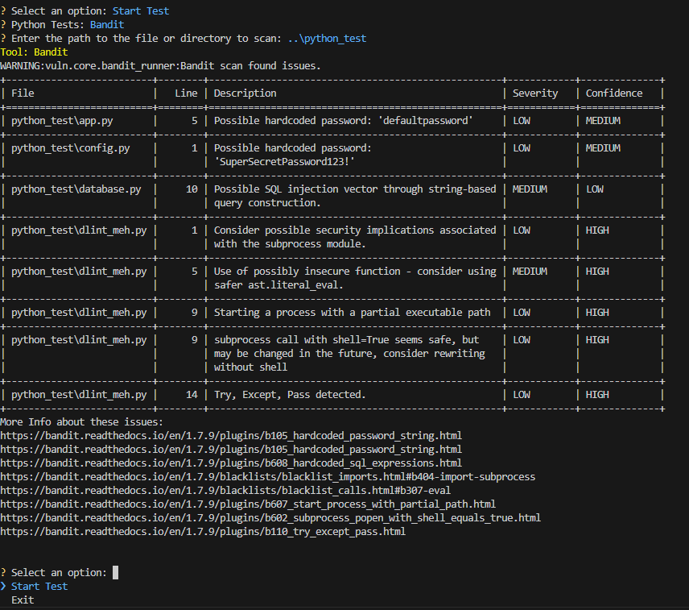

# Vuln: Python Security Scanner Tool


### Why Use Vuln?

Vuln is built for developers who want to take code security seriously without adding friction to their workflow. It centralizes popular open-source tools into a single, interactive CLI, helping teams detect insecure patterns, outdated packages, and risky configurations before they become production issues.


## Table of Contents
1. [Overview](#overview)
2. [Features](#features)
3. [Installation](#installation)
4. [Usage](#usage)
   1. [Requirements File](#requirements-file)
   2. [Sample Output](#sample-output)
5. [Running Tests](#running-tests)
6. [Branching Strategy](#branching-strategy)
7. [Contributing](#contributing)
8. [Future Improvements](#future-improvements)
9. [License](#license)


## Overview
**Vuln** is a Python-based security tool designed to help developers ensure their code adheres to ethical and secure coding practices. It provides an easy-to-use, interactive command-line interface (CLI) for scanning Python codebases and dependencies for common security vulnerabilities, potential bugs, and bad practices.

With **Vuln**, developers can quickly identify issues such as hardcoded credentials, unsafe function use, outdated dependencies, or other security risks that may compromise their application. The tool integrates several popular security and linting tools, making it a one-stop shop for improving Python code quality.
> Note: Vuln supports Python 3.8 and above.


## Features
Vuln supports the following tools for code analysis:

- **Bandit**: Scans Python code for security issues like hardcoded passwords, insecure functions, and potential SQL injection vulnerabilities. Learn more [here](https://bandit.readthedocs.io).
- **Checkov**: Scans infrastructure-as-code (IaC) files (e.g., Terraform) for misconfigurations that could lead to security issues. Learn more [here](https://www.checkov.io).
- **Safety**: Checks project dependencies for known vulnerabilities in third-party libraries. Learn more [here](https://pyup.io/safety/).
- **Trufflehog**: Scans code for secrets (API keys, credentials, etc.) that may have been accidentally committed. Learn more [here](https://github.com/trufflesecurity/truffleHog).
- **Flake8 (with dlint)**: Combines linting and code style enforcement with security-focused linting rules via dlint. Learn more [here](https://flake8.pycqa.org/) and [here](https://github.com/dlint-py/dlint).
- **Mypy**: Performs static type checking to ensure type safety in Python code. Learn more [here](https://mypy-lang.org/).
- **Radon**: Measures code complexity, helping to identify overly complex code that can be error-prone. Learn more [here](https://radon.readthedocs.io/).
- **Pylint**: Analyzes Python code for potential errors, bad practices, and coding standard violations. Learn more [here](https://pylint.pycqa.org/).

The tool features:
- **Interactive CLI**: Choose which tools to run, select paths interactively, and view detailed scan results.
- **Error Handling**: Clear and informative error messages help you resolve issues quickly.
- **Modular Design**: Easily extend the tool to include additional scanners or analysis tools.


## Installation

1. Clone the repository:
    ```bash
    git clone https://github.com/yourusername/vuln.git
    cd vuln
    ```

2. Create and activate a virtual environment:
    ```bash
    python -m venv venv
    venv\Scripts\activate     # On Windows
    ```
    ```bash
    python -m venv venv
    source venv/bin/activate  # On macOS/Linux
    ```

3. Install the required dependencies:
    ```bash
    pip install -r requirements.txt
    ```


## Usage

### Typical Usage Flow

1. **Start the CLI**

   Run the tool:
    ```bash
    python main.py
    ```
2. **Start Test**
    
    Select this option to begin scanning your code.

3. **Choose the test mode**

    - Run all tests: Executes all available scanners.

    - Select individual tools: Pick from tools like Bandit, Safety, Checkov, and others.

3. **Enter a file or directory path**

    Example: `../path_to_project_or_file`

4. **Review the results**

    A summary table will show detected issues with severity and confidence ratings.

5. **Next actions**

    - Run another test.
    - Exit the CLI.

### Requirements File

When using the Safety tool, Vuln expects to scan a requirements.txt file located in the root of your project. If your project uses a different file or the requirements file is stored elsewhere, you will be prompted to specify the path manually. For example: `../custom/path/to/requirements.txt`

### Sample Output
   

The results are JSON-parsed, making it easy to further process or integrate into other tools if necessary.

## Running Tests
Unit tests are provided to verify the functionality of the Bandit module. You can run the tests using:

```bash
python -m unittest tests.test_bandit_runner
```

Otherwise you can run this command:

```bash
python -m unittest discover -s tests
```

This command will run all unit tests and ensure that the module works as expected.

## Branching Strategy
To maintain a clean and organized codebase, we use the following Git branching strategy:

- main: Contains production-ready code.
- develop: Integration branch for development features.
- feature/bandit-module: Dedicated branch for the Bandit security scanner module.

All new features should be developed in their own feature branches and merged into `develop` after review and testing.


## Contributing
Contributions are welcome! Please follow these steps:

1. Fork the repository.
2. Create a feature branch:
    ```bash
    git checkout -b feature/your-feature
3. Commit your changes:
    ```bash
    git commit -m 'Add your feature'
4. Push the branch:
    ```bash
    git push origin feature/your-feature
5. Open a pull request to the `develop` branch.


## Future Improvements

- Expand scanning support by adding additional tool runners for languages and frameworks beyond Python.
- Extend documentation to guide users on automating Vuln in CI/CD pipelines and integrating scan results into automated workflows.
- Continue improving the CLI user experience based on feedback and evolving security practices.


## License
This project is licensed under the MIT License. See the [LICENSE](LICENSE) file for more information.

